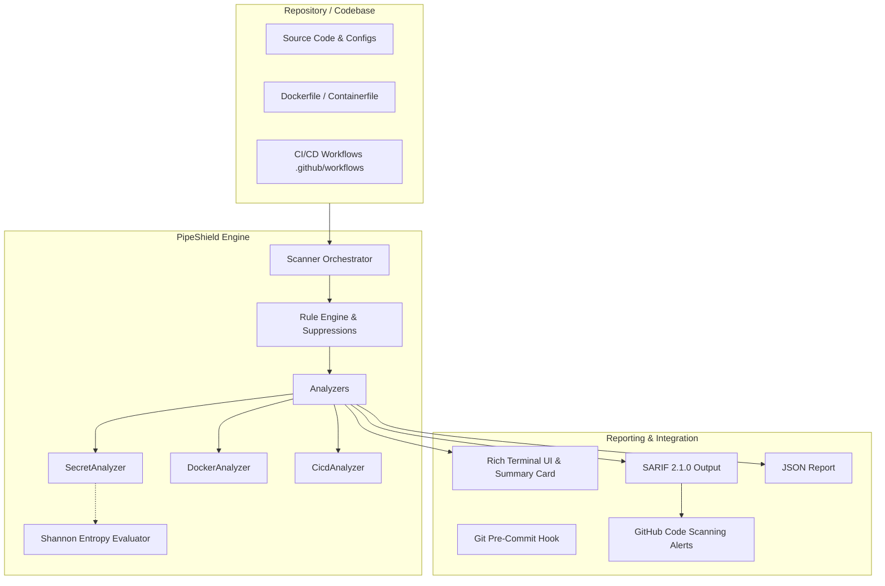

# 🛡️ PipeShield

[]()
[]()
[](LICENSE)
[]()
[]()

> **PipeShield** is a fast, modular DevSecOps security linter and static analyzer built for developers and AppSec engineers. It audits source code and infrastructure-as-code for **hardcoded credentials**, **container hardening violations**, and **CI/CD supply chain risks**, with native **OASIS SARIF 2.1.0** export for GitHub Advanced Security integration.

---

## ⚡ Why PipeShield?

In modern software delivery, security vulnerabilities are far cheaper to fix before code is merged. Most development teams struggle with fragmented tooling: one tool for secrets, another for Dockerfiles, and manual audits for CI/CD workflows.

**PipeShield unifies early security checks into a single, high-speed CLI tool:**
- 🔑 **Secrets & Credential Detection**: High-entropy strings (Shannon entropy analysis) + deterministic regex rules for 40+ credential types (AWS, GitHub, OpenAI, Slack, Stripe, JWT, DB URIs, Private Keys).
- 🐳 **Container Hardening (CIS Docker Benchmark)**: Flags root user execution (`USER root`), mutable `:latest` tags, plaintext credentials in `ENV`/`ARG`, `curl | sh` pipes, and missing health checks.
- ⛓️ **CI/CD Supply Chain Security**: Detects `permissions: write-all`, unpinned GitHub Actions (mutable tags vs. 40-character commit SHAs), script injection via untrusted PR contexts, and dangerous `pull_request_target` checkouts.
- 📊 **Enterprise Output Formats**: Rich interactive terminal output, machine-readable JSON, and standard **OASIS SARIF 2.1.0** for direct rendering in GitHub's **Security > Code scanning** tab.
- 🚀 **Zero External Dependencies**: Runs entirely offline in milliseconds without sending your proprietary code to third-party SaaS servers.

---

## 🏗️ Architecture



---

## 🚀 Quick Start

### Installation

Clone the repository and install with `pip` or `uv`:

```bash
git clone https://github.com/<your-username>/pipeshield.git
cd pipeshield

# Install with pip
pip install .

# Or run instantly with uv
uv run pipeshield --help
```

### Or Run via Docker

```bash
docker build -t pipeshield .
docker run --rm -v $(pwd):/workspace pipeshield scan /workspace
```

---

## 💻 CLI Usage

### 1. Audit a Repository
```bash
# Scan current directory
pipeshield scan .

# Scan with policy enforcement (exit code 1 if CRITICAL or HIGH findings exist)
pipeshield scan . --fail-on high

# Export SARIF (for GitHub Code Scanning) and JSON reports
pipeshield scan . --sarif results.sarif --json results.json
```

### 2. View Security Rules Catalog
```bash
pipeshield rules
```

### 3. Install Git Pre-Commit Hook
Prevent secrets and misconfigurations from ever entering your Git history:
```bash
pipeshield install-hook
```

### 4. Baseline & Rule Suppressions
Initialize a `.pipeshield-ignore` file to suppress false positives or accepted architectural risks:
```bash
pipeshield init
```
Example `.pipeshield-ignore`:
```ini
# Ignore directory or glob
tests/fixtures/*
docs/sample_config.py

# Suppress a rule globally
PS-SEC-009

# Suppress a specific rule only for a particular file
PS-DOCK-001:Dockerfile.local
PS-CICD-002:.github/workflows/experimental.yml
```

---

## 🎯 Testing the Demo Playground

PipeShield includes an intentionally vulnerable demo project in `examples/vulnerable_project/` so you can verify detection immediately:

```bash
pipeshield scan examples/vulnerable_project
```

Output highlights:
- 🔴 **CRITICAL**: Hardcoded AWS Access Key ID, OpenAI API Key, and Database credentials.
- 🔴 **CRITICAL**: `permissions: write-all` and command injection risk via `${{ github.event.pull_request.title }}` in CI/CD.
- 🟠 **HIGH**: Dockerfile base image unpinned (`FROM python:latest`), container running as `root`, and `curl | sh` execution.
- 🟡 **MEDIUM**: Local files transferred using `ADD` instead of `COPY`.

---

## 🛡️ Built-in Rule Catalog

| Rule ID | Category | Severity | CWE | Description |
|:---|:---|:---:|:---:|:---|
| `PS-SEC-001` | Secrets | **CRITICAL** | CWE-798 | Exposed AWS Access Key ID (`AKIA...`) |
| `PS-SEC-002` | Secrets | **CRITICAL** | CWE-798 | Exposed AWS Secret Access Key |
| `PS-SEC-003` | Secrets | **CRITICAL** | CWE-798 | Exposed GitHub Personal Access Token (`ghp_` / `github_pat_`) |
| `PS-SEC-004` | Secrets | **HIGH** | CWE-798 | Exposed Slack Webhook or Bot Token (`xoxb-...`) |
| `PS-SEC-005` | Secrets | **CRITICAL** | CWE-798 | Exposed OpenAI API Key (`sk-...` / `sk-proj-...`) |
| `PS-SEC-006` | Secrets | **CRITICAL** | CWE-798 | Exposed Stripe Live API Key (`sk_live_...`) |
| `PS-SEC-007` | Secrets | **CRITICAL** | CWE-312 | Unencrypted Private Cryptographic Key block (RSA/EC/PGP) |
| `PS-SEC-008` | Secrets | **HIGH** | CWE-798 | Database URI with embedded plaintext password |
| `PS-SEC-009` | Secrets | **MEDIUM** | CWE-798 | Hardcoded JSON Web Token (JWT) structure |
| `PS-SEC-010` | Secrets | **HIGH** | CWE-798 | Generic high-entropy secret assignment verified via Shannon entropy |
| `PS-DOCK-001` | Container | **HIGH** | CWE-250 | Missing non-root `USER` directive (container runs as root) |
| `PS-DOCK-002` | Container | **HIGH** | CWE-1104 | Unpinned base image tag (`:latest` or untagged) |
| `PS-DOCK-003` | Container | **CRITICAL** | CWE-798 | Sensitive credential baked into `ENV` or `ARG` layers |
| `PS-DOCK-004` | Container | **HIGH** | CWE-494 | Unverified download piped to shell (`curl ... \| sh`) |
| `PS-DOCK-005` | Container | **MEDIUM** | CWE-668 | Use of `ADD` instead of `COPY` for local files |
| `PS-DOCK-006` | Container | **LOW** | CWE-754 | Missing `HEALTHCHECK` instruction |
| `PS-DOCK-007` | Container | **HIGH** | CWE-250 | Sudo package installed in container image |
| `PS-CICD-001` | CI/CD | **CRITICAL** | CWE-250 | Overly permissive workflow permissions (`permissions: write-all`) |
| `PS-CICD-002` | CI/CD | **HIGH** | CWE-829 | Third-party action pinned to mutable tag rather than 40-char commit SHA |
| `PS-CICD-003` | CI/CD | **CRITICAL** | CWE-78 | Potential script injection via untrusted context into inline shell `run` |
| `PS-CICD-004` | CI/CD | **CRITICAL** | CWE-829 | Dangerous `pull_request_target` trigger with checkout of untrusted PR head |
| `PS-CICD-005` | CI/CD | **LOW** | CWE-400 | Missing `timeout-minutes` on CI jobs |

---

## 🔄 GitHub Actions CI/CD Integration

Embed PipeShield directly into your pull request pipeline with automated SARIF uploading to GitHub Code Scanning:

```yaml
name: Security Audit

on:
  push:
    branches: [ main ]
  pull_request:
    branches: [ main ]

permissions:
  contents: read
  security-events: write

jobs:
  pipeshield:
    runs-on: ubuntu-latest
    steps:
      - name: Checkout Code
        uses: actions/checkout@b4ffde5c8fafcde5c04619f5ecd0426728247c1b # v4.1.1

      - name: Set up Python
        uses: actions/setup-python@0a5c61591373683505ea898e09a8ea4db9642864 # v5.0.0
        with:
          python-version: "3.12"

      - name: Install PipeShield
        run: pip install .

      - name: Execute Security Scan
        run: |
          pipeshield scan . --fail-on high --sarif results.sarif

      - name: Upload SARIF to GitHub Code Scanning
        uses: github/codeql-action/upload-sarif@cdcdbb579706841c47f7063dda365e292e5cad7a # v3.24.8
        if: always()
        with:
          sarif_file: results.sarif
```

---

## 🧪 Running Tests

PipeShield is thoroughly tested with `pytest`:

```bash
uv run pytest -v
```

---

## 💼 Interview & Portfolio Highlights

If you are showcasing PipeShield on your resume or in technical interviews, consider highlighting:
1. **Design Decisions**: Why combining deterministic regex patterns with Shannon entropy ($H(X) = -\sum P(x)\log_2 P(x)$) reduces false positive fatigue for development teams.
2. **Supply Chain Defense**: How pinning third-party CI/CD actions to 40-character commit SHAs prevents supply chain attacks (similar to the SolarWinds and Codecov compromises).
3. **Standardization**: Why supporting OASIS SARIF 2.1.0 allows seamless integration into GitHub Advanced Security and enterprise SIEM/DevSecOps dashboards.
4. **Clean Code & Testing**: 100% test pass rate across modular rule engines, type hints, and decoupled analyzers following the Open-Closed Principle (SOLID).

---

## 📄 License

Distributed under the **MIT License**. See [LICENSE](LICENSE) for more information.
